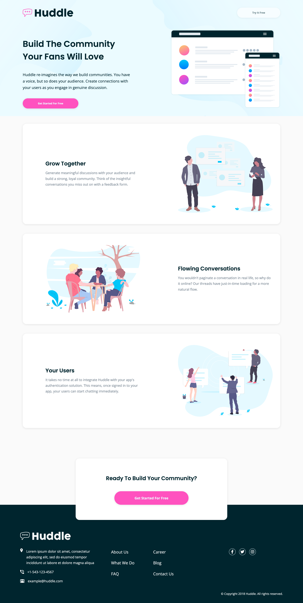

# Frontend Mentor - Huddle landing page with alternating feature blocks solution

This is a solution to the [Huddle landing page with alternating feature blocks challenge on Frontend Mentor](https://www.frontendmentor.io/challenges/huddle-landing-page-with-alternating-feature-blocks-5ca5f5981e82137ec91a5100). Frontend Mentor challenges help you improve your coding skills by building realistic projects. 

## Table of contents

- [Overview](#overview)
  - [The challenge](#the-challenge)
  - [Screenshot](#screenshot)
  - [Links](#links)
- [My process](#my-process)
  - [Built with](#built-with)
  - [What I learned](#what-i-learned)
  - [Useful resources](#useful-resources)
- [Author](#author)

## Overview

### The challenge

Users should be able to:

- View the optimal layout for the site depending on their device's screen size
- See hover states for all interactive elements on the page

### Screenshot



### Links

- [Solution](https://github.com/ryanthayes/fem-huddle-landing-page-with-alternating-feature-blocks)
- [Live URL](https://ryanthayes.github.io/fem-huddle-landing-page-with-alternating-feature-blocks)

## My process

### Built with

- Semantic HTML5 markup
- CSS custom properties
- Flexbox
- Mobile-first workflow

### What I learned

I used this "trick" from Andy Bell where there was unified spacing between the cards in the About section. Often times a good design will have consistent spacing and rhythm. This will add consistent spacing (margin) for each direct sibling in a section.

```css
.flow > * + * {
  margin-top: var(--flow-space, 2.5em);
}
```

### Useful resources

- [Andy Bell's Flow Utility Class](https://piccalil.li/quick-tip/flow-utility/) - Kevin Powell mentioned this on one of his YouTube videos. It is definitely useful and simplifies code if you have consistent spacing between elements in a div or section.

## Author

- Github - [@ryanthayes](https://github.com/ryanthayes)
- Frontend Mentor - [@ryanthayes](https://www.frontendmentor.io/profile/ryanthayes)
